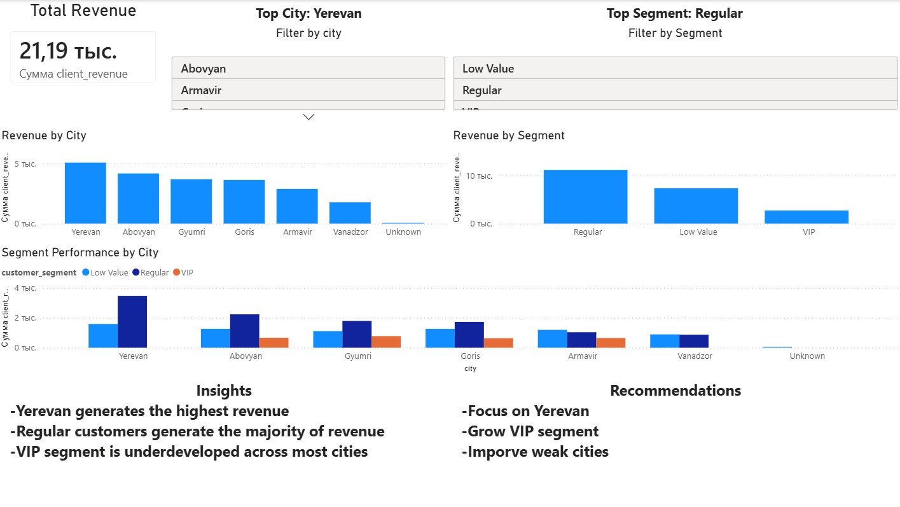

# 📊 Customer Revenue Analysis (End-to-End Data Project)

## 🚀 Project Overview

This project analyzes customer data and revenue to generate actionable business insights.

The goal is to identify:

* Top-performing cities
* Most valuable customer segments
* Revenue distribution patterns
* Business opportunities for growth

---

## ⚙️ Tech Stack

* **Python** (pandas, sqlite3)
* **SQL** (CTE, Aggregations)
* **SQLite**
* **Excel** (Pivot Tables)
* **Power BI** (Dashboard & Visualization)

---

## 🔄 Data Pipeline

1. Raw data collection (CSV)
2. Data cleaning using Python
3. Load data into SQLite database
4. Perform SQL analysis
5. Export results to CSV
6. Create dashboards in Excel & Power BI
7. Generate business insights

---

## 📁 Project Structure

customer-revenue-analysis/
── data/
── scripts/
── sql/
── outputs/
── dashboards/
── images/
── sales.db
── README.md

---

## 📊 Key Insights

* Yerevan generates the highest revenue
* Regular customers contribute the majority of revenue
* VIP segment is underdeveloped across most cities

---

## 💡 Business Recommendations

* Focus marketing efforts on Yerevan
* Increase VIP customer base
* Improve performance in low-revenue cities

---

## 📈 Dashboard

Power BI dashboard includes:

* Revenue by city
* Revenue by segment
* Segment performance across cities
* Interactive filters (city & segment)

---

## 🧠 Skills Demonstrated

* Data cleaning & preprocessing
* SQL analytics (GROUP BY, aggregations)
* Data pipeline building
* Dashboard design
* Business thinking & insights generation

---

## 📷 Preview

---

## 📌 Conclusion

This project demonstrates an end-to-end data analysis workflow, from raw data to business insights and visualization.
